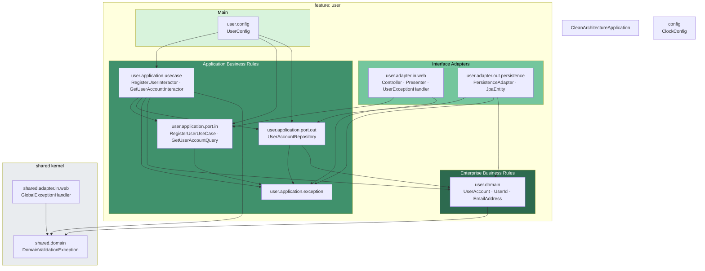
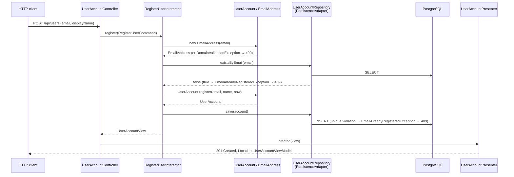
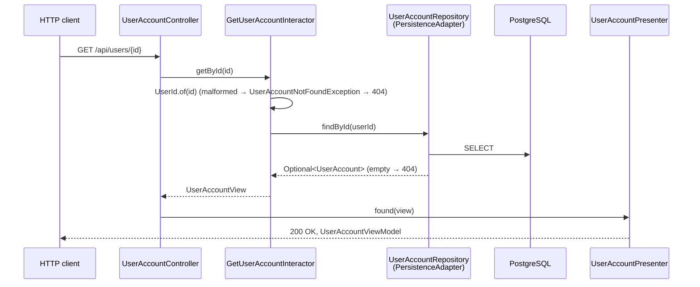
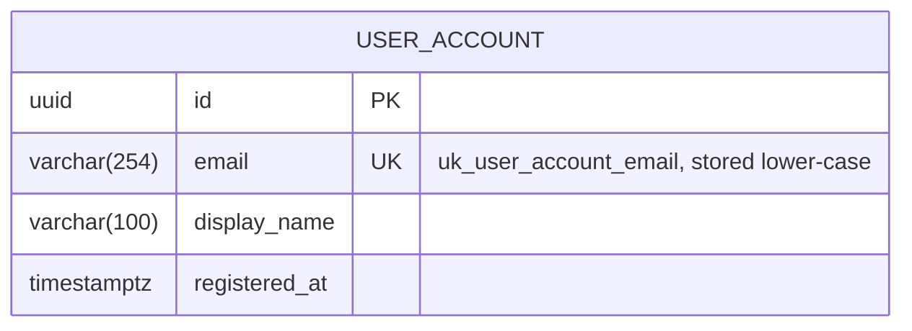
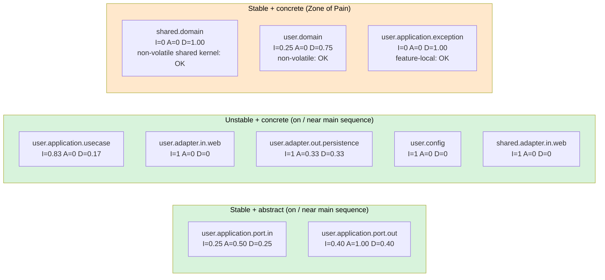
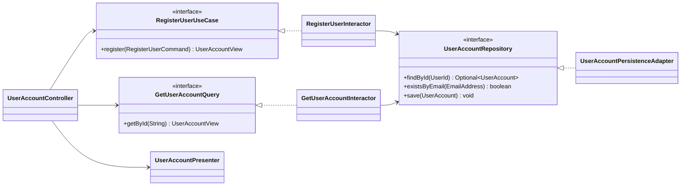

# Architecture Diagrams (Mermaid)

Rendered natively by GitHub and IntelliJ (Mermaid plugin). Standalone sources, one diagram per file: [`mermaid/`](mermaid/).

## 4a. Package dependency diagram, feature-first (arrows = source-code dependency)

## 4b-1. Sequence: Register user

## 4b-2. Sequence: Get user account

## 4c. Entity relationship diagram (Flyway schema V1)

## 4d. Component stability chart

## 4e. Ports and implementations (class diagram)

